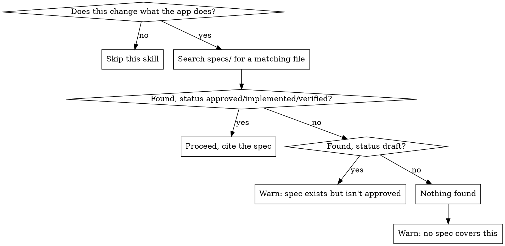

# Spec-driven development

This repo's own rule (`specs/CONSTITUTION.md`) is that requirements come
before design, and design comes before code — a `design/<slug>.md` is
never written against a `requirements/<slug>.md` still marked `draft`,
because that's how you end up designing the solution first and writing
requirements to match it after the fact. This skill is the habit that
keeps that rule from being quietly skipped when someone (a user or a
future you) just asks for a feature or a fix in plain language, without
mentioning specs at all.

**Read `specs/CONSTITUTION.md` first if you haven't this session** — it
owns the folder structure, the four spec types, the lightweight-vs-full
decision, and the templates. This skill doesn't repeat that; it's the
gate that makes sure it gets consulted.

If `specs/requirements/initial_requirements.md` doesn't exist yet, this
project hasn't been bootstrapped: for a brand-new, empty project use
the `spec-new-project` skill first; for an existing codebase with no
specs yet, use `spec-discovery` first. Both leave behind a baseline this
skill can then check new work against.

## When this applies

Anything that changes what the app *does* from a user's or API
consumer's point of view: a new feature, a behavior change, a bug fix
(the fix itself is a behavior change — "it should do X, currently does
Y"). It does not apply to work with no behavior delta: pure refactors,
formatting, dependency bumps, comments, docs, or infra/CI changes that
don't touch what the app does. If you're unsure which side a task falls
on, err toward running the check — it's cheap, and skipping it is the
failure mode this skill exists to prevent.



## Step 1: Does the user already name a spec?

If the request is already "implement `requirements/foo.md`" (or
similar), that's the fast path — read the full matching-slug set across
`requirements/`/`design/`/`validation/` (or the single
`lightweight/<slug>.md`), confirm it's `approved` (or further along),
and go. No need for the rest of this workflow — just check the status
field before treating it as authorization to code, since a `draft` spec
named directly is still a draft.

## Step 2: Otherwise, find out what already exists

Grep across `specs/product/`, `specs/requirements/`, `specs/design/`,
`specs/validation/`, and `specs/lightweight/` for the feature area —
by likely slug, by keywords from the request, and by skimming
`initial_requirements.md` (a lot of small behavior changes are
corrections to something already documented there, not new capability).
A bug fix in particular is often really a **discrepancy between an
approved spec and the code** — if so, that's your answer already:
no new spec file is needed, just point to the spec the code should have
been matching and proceed as a correction. Read each candidate file's
`**Status:**` line — don't assume from the filename alone.

## Step 3: Report what you found, then act on it

State this plainly before writing any implementation code — this is
the "verification" this skill produces, and it should be visible to the
user, not just a decision made silently in your own head:

```
## Spec check
- Matching spec(s): <path(s), or "none found">
- Status: <draft | approved | implemented | verified | none>
- Verdict: <one line>
```

Then:

- **Approved (or implemented/verified) spec found** → proceed, citing
  the file(s). This is the common case for well-covered areas and
  should add no friction.
- **Bug fix against an approved spec the code has drifted from** →
  proceed, citing the spec as the source of truth for what "fixed"
  means. No new spec file needed.
- **Spec found but still `draft`** → don't design or code against a
  draft. Say so, offer to walk through finishing it (fill gaps, then
  ask the user to flip `**Status:**` to `approved`), and ask the user
  how they want to proceed. If they say to go ahead anyway, that's
  their call — say clearly that you're proceeding without an approved
  spec, don't just quietly comply. If you're the one flipping
  `**Status:**` to `approved` and a `spec-issue-tracking` skill is
  installed (see `spec-issue-tracking-setup`), that's the trigger to
  use it — file (or check for) the tracking issue rather than leaving
  the newly-approved spec untracked.
- **Nothing found** → this is genuinely new or genuinely undocumented.
  Say so, and offer to draft one now: follow `specs/CONSTITUTION.md`'s
  own rule for picking lightweight vs. the full
  requirements/design/validation split, copy the matching template(s)
  from `specs/_templates/`, and fill them in with the user rather than
  guessing alone — requirements come from the person who wants the
  feature. As above, if the user says to proceed without one, name that
  explicitly rather than silently starting to code.

## Common ways this gets rationalized away — don't

| Thought | Reality |
|---|---|
| "It's just a one-line fix" | One-line fixes still change behavior; check whether an approved spec already says what the "right" behavior is — takes seconds, and it's exactly the case where drift is easiest to miss. |
| "The user clearly just wants X, no need to formalize it" | Clarity of intent isn't the same as an approved requirements doc someone can hold the implementation to later — that's the whole reason this repo has `specs/` instead of relying on chat history. |
| "I'll write the spec after I see it working" | This inverts the dependency order `CONSTITUTION.md` explicitly calls out as the failure mode: design-then-backfill-requirements. Write it first, even a short lightweight one. |
| "This is too small for `lightweight/`" | `CONSTITUTION.md` already covers this: default to lightweight when unsure, split out later if it turns out bigger than expected. Too small for lightweight essentially never happens. |
